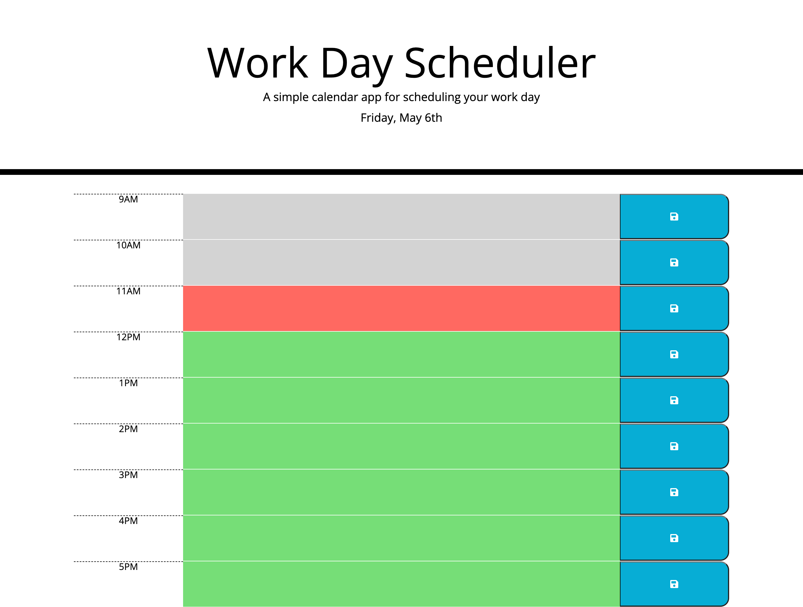

# Work Day Scheduler Starter Code

## Deployed Site
[Daily Work Scheduler](https://cmskorcz.github.io/daily-work-scheduler/)

## Utilization
Add tasks to be completed for that specified hour by clicking into the empty box. The box will then become an input, which can receive text as an input to be saved. Saving can be acheived by either pressing "Enter" on the keyboard, or by clicking the blue save button to the right of the input field.

User input is saved to the page, and will also be saved to the client's localstorage. Fields are editable when clicked again, and input can be changed or deleted. Saving after editing will replace the old input with new input.

Blocks are color coordinated in respect to the current time of the day. If the current hour is before the specified time, the block will be green. If the current hour and specified time are the same, then the box will be red in color. If the current hour is past the specified time, the box will be grey in color. These colors reset at the start of the next day.

